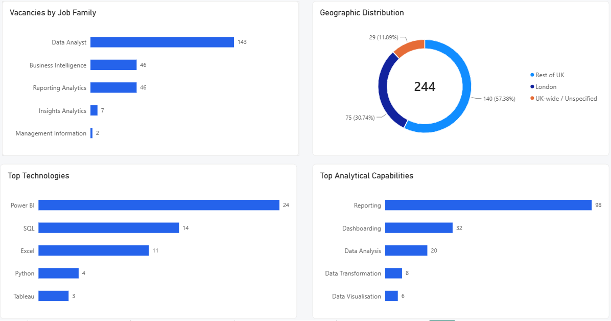
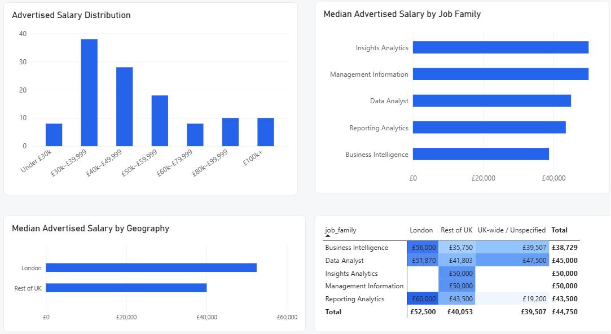
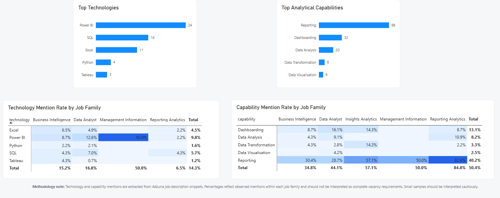
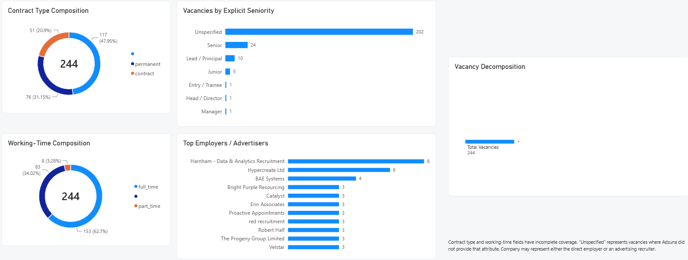

# UK Data Analyst Market Intelligence

An end-to-end data analytics project exploring the UK analytics job market using real vacancy data collected from the Adzuna API.

The project combines Python, SQL, text analysis, exploratory machine learning, dimensional modelling and Power BI to investigate market demand, salary patterns, geography, skills and employment structure.

---

## Executive Summary

This project analyses the UK market for core analytics roles, including:

- Data Analyst
- Business Intelligence
- Reporting Analytics
- Insights Analytics
- Management Information

The analysis began with 532 API observations collected using three complementary search queries. Following deduplication, occupational classification and scope filtering, 244 vacancies were identified as part of the Core Analytics market used for the main analysis and Power BI dashboard.

### Key Findings

- **244** Core Analytics vacancies were identified.
- **£44,750** median advertised salary.
- London recorded a median advertised salary of **£52,500**.
- Rest of UK recorded a median advertised salary of **£40,053**.
- The observed London salary premium was approximately **31.1%**.
- Only **49.2%** of Core Analytics vacancies had explicitly advertised salaries.
- **Power BI** was the most frequently detected technology in job-description snippets.
- **Reporting** was the most frequently detected analytical capability.
- **185** unique employers or advertisers appeared in the Core Analytics sample.
- **31.1%** of vacancies were explicitly marked as permanent.
- **62.7%** were explicitly marked as full-time.

---

## Dashboard

### 01 — Executive Overview



Provides a high-level view of market size, salary, geography, job-family composition and the most frequently observed technologies and analytical capabilities.

### 02 — Salary & Geography



Explores advertised salary distributions, salary differences between job families and the observed London salary premium.

### 03 — Skills & Technology



Examines technology and analytical-capability mentions extracted from Adzuna job-description snippets.

### 04 — Market Structure



Explores employer/advertiser concentration, seniority, contract structure, working-time structure and interactive vacancy decomposition.

---

## Analytical Pipeline

```text
Adzuna API
    ↓
Python Data Collection
    ↓
Data Cleaning & Deduplication
    ↓
Occupational Classification
    ↓
Exploratory Data Analysis
    ↓
Skills / NLP Analysis
    ↓
Exploratory Machine Learning
    ↓
SQL Analysis with DuckDB
    ↓
Dimensional Data Model
    ↓
Power BI